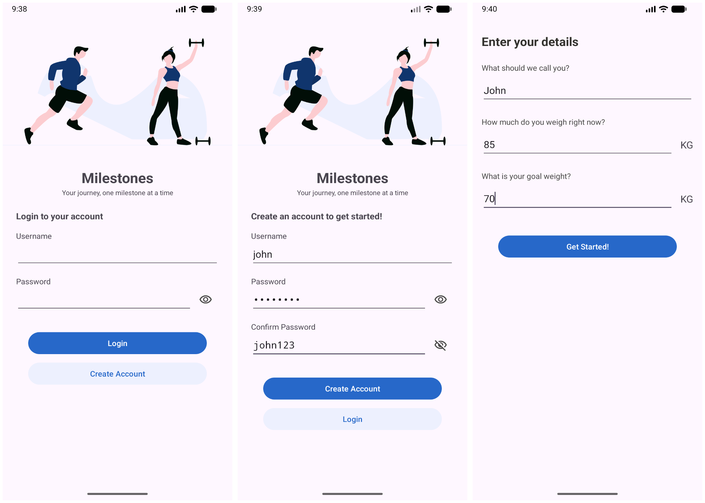
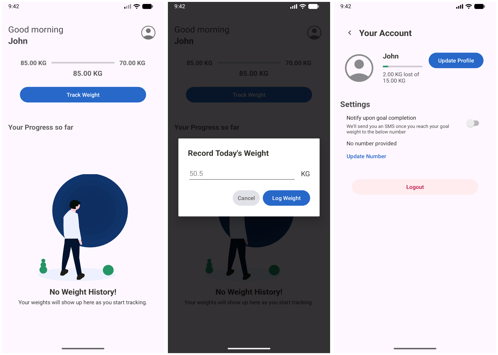
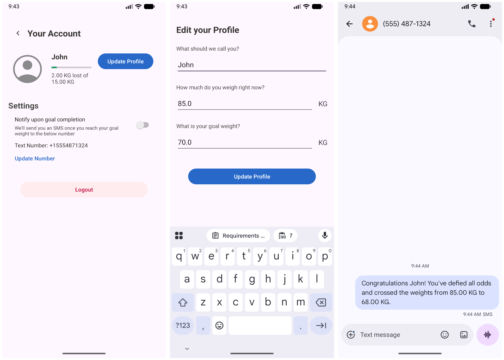

# Milestones

A simple weight-tracking Android application built with legacy XML-based layouts and Java.
Milestones is tailored for users who want to closely monitor their weight loss or gain journey. It
provides intuitive interactions, tracks daily logs via grid lists, and offers vital encouragement
through at-a-glance progress bars. Because weight changes take significant time to become
noticeable, the app also features an optional SMS notification system to send congratulatory
messages when users reach their goals.

*Note: This project was developed as a part of SNHU's CS360 course.*

## Screenshots

## How to run

1. Clone or download the project
2. Install [Android Studio](https://developer.android.com/studio) if you don't have it installed
   already.
3. Open the project and run
4. Alternatively, you can download the APK from the releases section.

**Make sure you have Android Studio Panda 4 | 2025.3.4 or later as this project uses AGP 9.2.1**

## Details

### Requirements and Goals

The primary goal of Milestones was to create a functional, persistent CRUD application using an
SQLite database that addresses the core needs of a user tracking their physical health. The app was
designed to address three specific user needs: a frictionless data-logging experience, visual
encouragement over long periods, and reliable data persistence across sessions (including persistent
user authentication).

### User-Centered UI Design

To keep the interface clean and minimal, the application is divided into distinct, purpose-driven
screens:

* **Authentication**: Split into separate Login and Register screens to avoid the confusion of a
  single page with multiple primary actions. It includes UX polishes like password visibility
  toggles and clear input validation hints. A dedicated screen for users to establish their
  baseline (name, current weight, goal weight).

* **Home (Tracking)**: Features an "at-a-glance" visual progress bar alongside a grid list (
  RecyclerView) of logged weights. This solves the UX problem of users having to sift through raw
  data to understand their trajectory.

* **Profile**: Allows users to dynamically update their goals (accommodating changing fitness
  targets) and toggle the optional SMS feature.

* **Empty States**: Instead of staring at a blank screen upon first login, the Home screen provides
  an engaging empty state layout encouraging the user to log their first weight.

These designs were successful because they were driven by a user persona—ensuring the application
remains an encouraging tool rather than a tedious ledger.

### Coding Approach and Strategies

The development process followed a UI-first approach, moving sequentially from visual layouts to
data models, and finally to the controller layers. To ensure modularity, I utilized the Repository
pattern to create a unified interface for data access (SQLite database and SharedPreferences),
keeping the Activity classes lightweight. I applied a vertical slice strategy—building and
perfecting one feature end-to-end before moving to the next. This acted as a strict guardrail
against scope creep.

In the future, while these foundational architectural concepts remain highly applicable, I would
transition this logic to modern toolkits like Kotlin, Jetpack Compose, and Room. Leveraging Kotlin's
Flows and Coroutines would significantly reduce boilerplate click-listener code, handle asynchronous
database queries seamlessly off the main thread, and decouple the UI even further.

### Testing

While I heavily favor Test-Driven Development (TDD) for ensuring robust logic, strict time
constraints for this project required a pivot to comprehensive manual testing. I tested the
application across various device sizes, orientations (Portrait/Landscape), and API levels. This
multi-device testing was crucial; it revealed a compatibility bug where the modern SmsManager
implementation failed on Android 7 (API 24), which I subsequently patched with a version-check
fallback. This process reinforced that testing is a mandatory phase of the SDLC to ensure true
cross-platform reliability, regardless of the tools used.

### Innovation and Overcoming Challenges

A significant challenge arose with the Home screen layout. Standard vertical scrolling became
cumbersome when balancing a progress dashboard and a long list of historical data. To innovate, I
developed a dedicated landscape layout (layout-land) that splits the screen perfectly using layout
weights. This provides a premium, tablet-like experience where the tracking actions sit on the left,
and the efficient RecyclerView handles history scrolling on the right. Additionally, implementing
the at-a-glance progress bar—though not strictly required by the baseline rubric—was a UX innovation
necessary to overcome a confusing, data-heavy tracking experience.

### Skill Demonstration

I was particularly successful in demonstrating my knowledge of application architecture and layer
separation. Drawing on structural patterns I learned while completing my Meta Android Developer
certification, I successfully implemented a decoupled Repository pattern in a legacy Java/XML
environment. By isolating the SQLite database queries, abstracting input validation into dedicated
utility classes, and using DialogFragment for modular interactions, I ensured the codebase adheres
strictly to the Single Responsibility Principle while maintaining a polished, professional user
experience.
